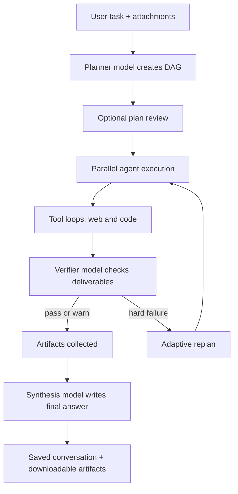

# Maestro

Maestro is a zero-dependency Node.js multi-model agent orchestrator with a
Claude-style browser UI. It plans tasks, routes work across an OpenRouter model
fleet, runs agents with web/code tools, verifies deliverables, tracks cost, and
streams the whole run into an interactive DAG.

The project is intentionally small: one Node HTTP server, one vanilla frontend,
flat-file persistence, and a Vercel catch-all entry for hosted deployment.

## Quick Start

```bash
npm start
# or
node server.js
```

Open `http://localhost:4646`, click Settings, add an OpenRouter API key, and
send a task.

Run without model spend:

```bash
npm run mock
# or
MOCK=1 node server.js
```

Requirements:

- Node.js `>=18.17`
- `python3` on `PATH` for Python code execution
- Optional host runtimes for more code tools: `node`, `bash`, `ruby`, `perl`,
  `java`, `swift`, `cc`, `c++`, `go`, `rustc`

Environment variables:

| Variable | Purpose |
|---|---|
| `OPENROUTER_API_KEY` | Overrides the key stored in settings. Required for live runs unless mock mode is enabled. |
| `MOCK=1` | Forces simulated runs globally. |
| `PORT` | Local HTTP port, default `4646`. |
| `MAESTRO_DATA_DIR` | Overrides the runtime data directory. |
| `MAESTRO_ACCESS_CODE` | When set, every `/api/*` request must present this code (header `x-maestro-access` or cookie `maestro_access`). The UI prompts for it once. Use it on any public deployment. |
| `VERCEL` | Set by Vercel; switches storage and hosted-run behavior. |
| `TURSO_DATABASE_URL` | Cloud database URL (`libsql://…`). The Vercel Turso integration injects this automatically — connect the database to the project and hosted persistence (chats, files, memory, settings, cost ledger) turns on without further config. Overrides the Settings value. |
| `TURSO_AUTH_TOKEN` | Cloud database auth token; injected by the Turso integration alongside the URL. |

## What It Does

Local mode runs the full orchestration pipeline:



Hosted Vercel mode is deliberately different. Vercel functions have a hard
runtime limit and cannot reliably share in-memory run state across separate
requests, so hosted runs use one streamed request and one focused direct agent.
That avoids the expensive planner/verifier/synthesis fan-out and is designed to
finish inside the 300 second function limit.

With the Turso cloud database connected (see env vars above), hosted mode stops
being amnesiac: conversations and settings persist across cold starts and can
be continued, uploads survive (≤4 MB), the hosted agent gets the full memory
tool set plus post-run extraction (on an 8 s leash so it never threatens the
time limit), and every run lands in the cost ledger. Without the database,
hosted memory stays read-only-outline and nothing persists — by design, not by
accident.

## Runtime Modes

| Mode | Trigger | Behavior |
|---|---|---|
| Local live | `node server.js` | Full planner -> review -> parallel agents -> verification -> adaptation -> synthesis pipeline. |
| Local mock | `MOCK=1 node server.js` | Simulated orchestration with streaming DAG, retry, verification, and answer output. No API key required. |
| Vercel live | Deployed under Vercel | One direct hosted agent, no plan review, no verifier, no synthesis pass, no retries, capped tool/output budgets. |
| Vercel mock | Hosted Settings -> Mock mode | Simulated hosted stream for checking the UI without OpenRouter spend. |

## Project Structure

```text
.
├── README.md                 Project guide and architecture notes
├── .gitignore                Ignores runtime data, logs, node_modules, macOS files
├── package.json              Node package metadata and scripts
├── vercel.json               Vercel function duration config
├── Dockerfile                Full-pipeline container image (recommended hosting)
├── .dockerignore             Keeps data/, results, and git out of the image
├── fly.toml                  Fly.io app config (volume, SSE-friendly service)
├── server.js                 HTTP server, API routes, SSE, static files, access gate
├── api/
│   └── [...path].js          Vercel catch-all wrapper that exports server.js
├── src/
│   ├── orchestrator.js       Core run lifecycle and event emission
│   ├── prompts.js            Planner, agent, verifier, replan, synthesis prompts
│   ├── tools.js              Web/code/workspace tools used by agents
│   ├── openrouter.js         Streaming OpenRouter client and retry handling
│   ├── models.js             Curated model fleet and live OpenRouter pricing
│   ├── store.js              Flat-file settings, conversations, uploads
│   ├── mock.js               Simulated run engine for demos/tests
│   ├── paths.js              Project/data path resolution
│   └── util.js               IDs, truncation, JSON extraction, sleep
├── public/
│   ├── index.html            App shell and CDN links for KaTeX/Mermaid
│   ├── app.js                Vanilla JS state, rendering, SSE, settings, uploads
│   └── styles.css            Complete UI styling and responsive layout
├── bench/
│   ├── tasks.jsonl           Benchmark task corpus (27 tasks, 5 categories)
│   ├── run.js                Benchmark runner: maestro vs single-model baselines
│   └── results/              Timestamped results.jsonl + report.md (git-ignored)
├── .claude/
│   └── launch.json           Local launch config for port 4646
└── data/                     Runtime state, git-ignored
    ├── settings.json         Local settings and keys
    ├── conversations/        Saved chats and run snapshots
    ├── files/                Uploaded file blobs and metadata
    ├── sandbox/venv/         Python virtualenv created at startup
    └── workspaces/<runId>/   Per-run staged inputs and artifacts
```

`data/` is not committed. On Vercel, the same logical data root is under
`/tmp/maestro-data`, so it is ephemeral and may disappear across cold starts or
redeploys.

## Server Architecture

`server.js` exports a single `handler(req, res)` used both by the local HTTP
server and the Vercel catch-all route.

Startup work:

- Initializes flat-file storage with `store.init()`.
- Starts live OpenRouter model/pricing refresh in the background.
- Detects sandbox runtimes and prepares the Python venv in `data/sandbox/venv`.
- Serves `public/` as static files outside `/api/*`.

Important constants:

- Local port: `4646` unless `PORT` is set.
- JSON body limit: `25MB`.
- Hosted graceful stop: `270s`, before Vercel's `300s` function timeout.
- Active in-memory runs are trimmed after 20 finished runs.

## API Surface

| Method | Route | Purpose |
|---|---|---|
| `GET` | `/api/bootstrap` | Returns masked settings, model catalog, conversations, mock-forced flag. |
| `POST` | `/api/settings` | Saves settings. Empty secret fields mean "keep existing value". |
| `POST` | `/api/upload` | Saves an uploaded file blob and metadata. |
| `GET` | `/api/conversation/:id` | Loads a saved conversation and reports an active run if present. |
| `DELETE` | `/api/conversation/:id` | Deletes a saved conversation. |
| `POST` | `/api/run` | Starts a local background run, then clients subscribe via EventSource. |
| `POST` | `/api/run-stream` | Starts and streams a run over the same response. Used by hosted mode. |
| `POST` | `/api/runs/:id/stop` | Aborts an active run. |
| `POST` | `/api/runs/:id/plan` | Approves/cancels a plan-review gate, optionally with node edits. |
| `GET` | `/api/events/:runId` | SSE event replay/subscribe endpoint for local runs. |
| `GET` | `/api/runs/:id/files/*` | Serves workspace artifacts with sandboxing/CSP headers. |
| `DELETE` | `/api/memories/:id` | Forgets one long-term memory entry; returns the remaining list. |

Artifact serving:

- Text, images, PDF, and HTML can render inline.
- SVG uses a restrictive CSP sandbox.
- HTML artifacts use `sandbox allow-scripts allow-pointer-lock`, so apps/games
  can run without access to the Maestro origin.
- Paths are resolved under the run workspace and cannot escape it.

## Orchestrator Lifecycle

The core lifecycle lives in `src/orchestrator.js`.

1. `createRun()` creates run state, workspace path, event log, totals, and abort
   controller.
2. `executeRun()` prepares the workspace, plans or creates a hosted direct plan,
   executes the graph, collects artifacts, synthesizes an answer, emits `done`,
   and persists the final snapshot.
3. `emit()` stores every event in `run.events` and relays compact SSE payloads
   to subscribers.
4. `snapshot()` stores the durable run shape inside the conversation.

Local full pipeline:

- `planPhase()` calls the orchestrator model with `plannerSystemPrompt()`.
- `validatePlan()` normalizes nodes, caps at 12, drops dangling dependencies,
  and rejects cycles.
- `approvalGate()` optionally pauses until the UI approves, edits, deletes, or
  cancels nodes.
- `executeGraph()` runs dependency-ready nodes in parallel up to `maxParallel`.
- `runNode()` executes one node, verifies it if needed, and retries with
  verifier feedback up to `maxRetries`.
- `maybeAdapt()` can revise pending nodes after hard failures, up to 2 replans.
- `collectArtifacts()` lists workspace files that are not unchanged staged
  attachments.
- `synthesisPhase()` either streams a single-node output directly or calls the
  orchestrator model to merge all node outputs.

Hosted direct pipeline:

- `createHostedDirectPlan()` builds one node named `Complete request`.
- It heuristically grants `web` and/or `code` tools based on the task and
  attachments.
- It disables plan review, retries, verifier calls, replanning, and synthesis.
- It uses tighter tool and max-token budgets:
  - `HOSTED_TOOL_ROUNDS = 4`
  - `none: 4500`, `low: 5500`, `medium/high: 6500` output-token caps

## Event Model

Runs stream typed events to the frontend. Key event types:

| Event | Meaning |
|---|---|
| `meta` | Streamed-run metadata: run id, conversation id, title. |
| `phase` | Run phase: planning, awaiting approval, running, synthesis, done, error, stopped. |
| `plan` | Initial or edited DAG plan. |
| `plan_delta` | Live planner/replanner text stream, split into thinking/json buffers. |
| `plan_updated` | Adaptive replan changed the DAG. |
| `adapt_decision` | Replanner chose to proceed without changes. |
| `node_status` | Node status/attempt/error changes. |
| `node_delta` | Live node output text. |
| `node_result` | Final compact node stats. Full output stays in server snapshot. |
| `verify_result` | Verifier score/pass/feedback. `score >= 5` is a pass. |
| `tool_call` / `tool_result` | Tool activity for the node Activity tab. |
| `artifacts` | Workspace artifact list. |
| `usage` | Cumulative calls, input tokens, output tokens, cost. |
| `answer_delta` / `answer_done` | Final answer stream. |
| `error` | Run or node error. Stopped hosted runs carry a `stopMessage`. |
| `done` | Final compact run snapshot marker. |

For hosted streams, `compactEventForStream()` removes large node outputs from
`node_result` and sends compact `done` data. The browser merges compact data
with its live state.

## Agent Tools

Tools live in `src/tools.js` and are exposed by tool groups in a node plan:

| Group | Tools |
|---|---|
| `web` | `web_search`, `fetch_url` |
| `code` | `run_code`, `pip_install`, `write_file`, `read_file`, `list_files` |

Web behavior:

- Brave Search is preferred when `braveApiKey` is configured.
- DuckDuckGo Lite/HTML are fallbacks.
- `fetch_url` accepts only public `http(s)` URLs and blocks local/private
  addresses.
- Fetched text is stripped and capped.

Code behavior:

- Each run has an isolated workspace under `data/workspaces/<runId>`.
- `run_code` executes snippets in `.tmp/` inside that workspace.
- Python uses a virtualenv if available, with `sympy` and `openpyxl` installed
  by setup and system packages available through `--system-site-packages`.
- The environment strips variables that look like keys, tokens, secrets,
  passwords, or credentials.
- `MPLBACKEND=Agg` is set so Matplotlib saves images headlessly.
- `run_code` timeout is capped at 120 seconds.
- `pip_install` is capped at 240 seconds and validates package names.
- `write_file` refuses content over 2MB and cannot escape the workspace.
- `read_file` and tool results are capped before returning to models/UI.

## Model Fleet

The fleet is defined in `src/models.js`.

Current catalog size: 17 models across frontier, mid, and budget tiers. The
catalog includes Claude, OpenAI, Gemini, GLM, Nemotron, DeepSeek, Qwen, Kimi,
Grok, and Mistral entries.

At startup `ensureLivePricing()` fetches OpenRouter's public model catalog and:

- updates input/output prices,
- updates context lengths,
- marks missing slugs unavailable,
- detects `:free` variants,
- records whether free variants support tools.

`routeModel()` uses `:free` variants first when `preferFree` is enabled and the
variant can satisfy tool requirements. If the free route fails or rate limits,
`openrouter.js` retries the paid slug.

## OpenRouter Client

`src/openrouter.js` is a minimal streaming client for
`https://openrouter.ai/api/v1/chat/completions`.

It supports:

- SSE parsing without dependencies,
- content deltas,
- reasoning deltas,
- tool-call deltas,
- OpenRouter usage accounting,
- estimated fallback cost when usage cost is absent,
- retries for retryable failures,
- free-variant fallback routing,
- restart callbacks so already-streamed partial UI can be reset safely.

## Prompts

All system/user prompt builders live in `src/prompts.js`.

| Function | Role |
|---|---|
| `plannerSystemPrompt()` | Teaches the orchestrator model how to build a cost-aware DAG. |
| `plannerUserPrompt()` | Adds date, conversation history, attachments, and task. |
| `agentSystemPrompt()` | Gives each node its standalone brief, deliverables, tool rules, and output rules. |
| `verifierSystemPrompt()` | Defines verification standards and the `score >= 5` pass rule. |
| `verifierUserPrompt()` | Supplies objective, deliverables, rubric, and output to check. |
| `replanSystemPrompt()` / `replanUserPrompt()` | Lets the orchestrator recover from failed nodes. |
| `synthesisSystemPrompt()` / `synthesisUserPrompt()` | Produces the final user-facing answer. |

Editing these prompt builders is the main way to change Maestro's behavior.

## Frontend

The frontend is vanilla HTML/CSS/JS in `public/`.

`index.html`:

- Defines the sidebar, chat area, composer, modal root, and upload input.
- Loads `styles.css` and `app.js`.
- Loads KaTeX and Mermaid from CDN; both fail gracefully offline.

`app.js` responsibilities:

- Holds global UI state: settings, models, conversations, active chat, live run,
  EventSource, streamed fetch abort controller, and timer.
- Renders markdown, code blocks, tables, math placeholders, Mermaid blocks,
  artifact images, and sandboxed HTML previews.
- Renders the DAG, node cards, status icons, plan editor, activity logs,
  verifier results, artifacts, and final answer.
- Handles settings, hosted localStorage settings, theme, uploads, chat list,
  conversation restore, send/stop controls, and stream recovery.
- Uses `/api/run` + `/api/events/:id` locally and `/api/run-stream` in hosted
  mode.
- Recovers hosted streams by checking the saved conversation after a disconnect;
  if no final snapshot exists, it preserves the partial run as stopped with a
  warning instead of showing the old hard failure.

`styles.css`:

- Implements light/dark themes with CSS variables.
- Styles the sidebar, composer, chat bubbles, markdown, DAG, node detail,
  plan-review editor, tool timeline, artifacts, modal, KaTeX/Mermaid, and
  responsive mobile layout.

## Persistence

`src/store.js` is a facade over two backends:

- **Local flat files** under `DATA_ROOT` — always on, zero-config.
- **Cloud libSQL/Turso database** (`src/db.js`, plain-fetch HTTP client, no
  dependencies) — optional. Configure via Settings → Cloud database or the
  `TURSO_DATABASE_URL` / `TURSO_AUTH_TOKEN` env vars. When connected,
  conversations, uploaded files (≤4 MB), settings, memory, verifier verdicts,
  and a per-run cost ledger (`runs` table) are written through to the cloud
  and read from it — chats continue across restarts, machines, and hosted
  deployments. On first connect, existing local history is migrated up
  automatically. If the cloud is unreachable, Maestro degrades to local files
  instead of breaking. The schema self-migrates (`CREATE TABLE IF NOT EXISTS`)
  on every connect.

| Path | Contents |
|---|---|
| `data/settings.json` | API keys, model choices, preferences, mock flag, cloud DB credentials (the one thing that must stay local to bootstrap). |
| `data/conversations/*.json` | Chat messages, assistant run snapshots, cost. |
| `data/files/*.bin` | Uploaded file bytes. |
| `data/files/*.json` | Upload metadata and text previews. |
| `data/workspaces/<runId>/` | Staged attachments and generated artifacts. |
| `data/sandbox/venv/` | Python virtualenv for code execution. |
| `data/stats.json` | Verifier verdicts per model (pass/score/escalation) — fed back into the planner prompt as measured reliability once a model has 3+ samples. |
| `data/memory.json` | The hierarchical memory register (see below). |
| `data/runs.jsonl` | Append-only cost ledger: one row per run (cost, frontier baseline, savings, tokens). |

## Memory: the hierarchical register

Long-term memory is a **register**: every durable fact lives at a path like
`preferences/format`, `privatleben/familie/kind`, or `work/projects/maestro`
(`src/memory.js`). The register differentiates as it grows — branches with too
many direct entries are flagged ⚠ crowded, and the post-run extractor moves
their entries into more specific subpaths.

Token economics by design:

- Every prompt (planner, synthesis, every agent) gets only a compact **outline**
  of the register. While the register is small the outline *is* the full
  content (no tool round wasted); past ~1600 chars it compresses to truncated
  facts and branch summaries, prioritizing recently used branches.
- **Every agent** carries four memory tools automatically (never planned):
  `memory_search` / `memory_read` pull details on demand (reads bump `usedAt`,
  which drives outline priority), `memory_write` stores a durable fact the
  moment it appears mid-run, `memory_forget` deletes by id.
- After each run, a cheap extractor model reviews the exchange against the
  register with ids: it files what agents missed, prunes contradicted entries,
  and splits crowded branches (`add` / `move` / `remove` ops).

Every entry is visible and deletable in Settings; secrets are banned from
storage by prompt; a global toggle turns the whole system off.

File classification:

- Images: MIME starts with `image/`.
- PDFs: `application/pdf` or `.pdf`.
- Text: text MIME, known text MIME, or recognized source/data extension.
- Everything else: binary.

## Settings

Defaults live in `src/store.js`.

| Setting | Default | Notes |
|---|---|---|
| `apiKey` | empty | Stored locally unless `OPENROUTER_API_KEY` overrides it. |
| `braveApiKey` | empty | Optional; improves web search quality. |
| `userName` | `Mateo` | Used for greeting/avatar. |
| `orchestratorModel` | `anthropic/claude-opus-4.5` | Planner, replanner, synthesis, and hosted direct agent model. |
| `verifierModel` | `openai/gpt-5-mini` | Verifier in local full mode. |
| `fallbackModel` | `openai/gpt-5-mini` | Used if a planned model is unavailable. |
| `maxParallel` | `4` | Local graph concurrency, clamped to `1..8`. |
| `maxRetries` | `1` | Node retries after verifier failure, clamped to `0..3`. |
| `approvePlans` | `true` | Local plan-review gate. Forced off on Vercel. |
| `preferFree` | `true` | Try OpenRouter `:free` variants first. |
| `mock` | `false` | Simulate runs without model calls. |
| `maxRunCost` | `0` | Hard per-run spend ceiling in USD; the run aborts cleanly (partial work saved) when reached. `0` disables the cap. |
| `memoryEnabled` | `true` | The hierarchical memory register: outline injected into every prompt, memory tools granted to every agent, post-run extraction/reorganization. Viewable/deletable in Settings. |
| `tursoUrl` | empty | Cloud database URL (`libsql://…`). Empty = local files only. |
| `tursoToken` | empty | Cloud database auth token. Env vars `TURSO_DATABASE_URL`/`TURSO_AUTH_TOKEN` override both. |

Hosted UI settings are persisted in browser localStorage under
`maestro-hosted-settings` and sent with each `/api/run-stream` call, because
Vercel's filesystem is ephemeral.

## Attachments and Artifacts

Upload flow:

1. Browser converts selected files to base64 and posts `/api/upload`.
2. Server stores bytes and metadata under `data/files/`.
3. Planner receives attachment metadata and short previews for text files.
4. Selected node attachments are inlined when possible or staged into the
   workspace for code tools.

Artifact flow:

1. Agents write files with `write_file`, Matplotlib `savefig`, or normal code.
2. `autoSaveCode()` saves substantial fenced code blocks that were only written
   in an answer.
3. `collectArtifacts()` lists workspace files that are not unchanged staged
   attachments.
4. The UI renders download chips, image galleries, and playable HTML previews.

## Hosted Deployment

### Docker / Fly.io / Railway — recommended (full pipeline)

A long-running container runs the exact same pipeline as local mode: planner,
parallel agents, verifier, adaptive replanning, synthesis, durable state.
This is the deployment to show people.

Docker:

```bash
docker build -t maestro .
docker run -p 4646:4646 -v maestro_data:/data \
  -e OPENROUTER_API_KEY=sk-or-... \
  -e MAESTRO_ACCESS_CODE=choose-a-code \
  maestro
```

Fly.io (config in `fly.toml`):

```bash
fly launch --no-deploy
fly volumes create maestro_data --size 1
fly secrets set OPENROUTER_API_KEY=sk-or-... MAESTRO_ACCESS_CODE=choose-a-code
fly deploy
```

Railway: create a project from the repo — it picks up the `Dockerfile`
automatically. Attach a volume at `/data` and set the same two variables.

Notes:

- **Always set `MAESTRO_ACCESS_CODE` on a public deployment.** The server
  spends your OpenRouter key and executes model-written code; the access gate
  is what stands between that and the open internet.
- The deployment is single-tenant: all visitors share one settings file and
  one conversation list.
- The image ships python3 with numpy/pandas/matplotlib (apt) so `run_code`
  charts work out of the box; the venv is created on the volume at first boot.

### Vercel — legacy (degraded single-agent mode)

The Vercel path still works (`api/[...path].js` + `vercel.json`,
`maxDuration` 300) but is constrained by the platform:

- Conversation and file state live under `/tmp/maestro-data` and are not
  durable.
- Plan review is disabled; runs use the direct single-agent path.
- Tool and output budgets are smaller.
- No verifier, no adaptive replanning, no synthesis call, and no retries.
- A timer aborts at 270 seconds with a clear stop message before Vercel's 300
  second hard timeout.

Use the container deployment (or local mode) for real multi-agent jobs.

## Benchmarks

`bench/tasks.jsonl` is the task corpus (27 tasks across `code`, `math`,
`research`, `realworld`, `agentic`); `bench/run.js` is the runner. It exists
to turn Maestro's core claim — frontier-quality output at a fraction of
frontier cost — into a measured number.

```bash
npm run bench                       # maestro vs opus-only, all tasks
node bench/run.js --only c1,m1      # subset by id
node bench/run.js --category code   # subset by category/tier
node bench/run.js --modes maestro,single:openai/gpt-5.1
node bench/run.js --mock            # pipeline smoke test, zero spend
node bench/run.js --list            # show the corpus
```

Each task runs through one or more modes — `maestro` (full pipeline) and
`single:<model>` baselines (one agent node on that model with the same web/code
tools, no verifier, no retries) — and is scored by its `scoring` field:

| Scoring | How it's graded |
|---|---|
| `tests` | The task's Python asserts execute against the run workspace. |
| `exact` | The expected string must appear in the final answer. |
| `judge` | A judge model (default `gpt-5.1`, `--judge` to change) scores 0–10. |
| `judge+checks` | Judge score gated by programmatic checks: required artifacts exist, test commands pass, citation domains present. Failed checks cap the score at 4. |
| `exact-runtime` | Live-web research tasks — judged, since there is no offline ground truth; flagged in the report. |

Results land in `bench/results/<timestamp>/` as `results.jsonl` plus a
`report.md` with a mode-comparison summary ("Maestro: X% pass at $A vs
opus-only: Y% pass at $B"). `preferFree` is off during benchmarks so costs
reflect real paid prices; runs are billed to your OpenRouter key.

## Security and Cost Notes

- `data/` is git-ignored because it may contain API keys, uploads,
  conversations, and generated files.
- Model providers receive task content routed to them through OpenRouter.
- `run_code` executes model-written code on the host machine, scoped to the
  workspace and with secrets stripped from the child environment, but it is not
  a container or VM.
- `fetch_url` blocks localhost and private network addresses.
- API keys are masked when sent to the browser.
- OpenRouter-reported costs are accumulated per call, node, run, and
  conversation.
- The Stop button aborts the run's `AbortController`.

## Development Notes

- No build step and no runtime dependencies are required.
- Prefer changing behavior in `src/prompts.js`, model routing in
  `src/models.js`, and run lifecycle in `src/orchestrator.js`.
- Run syntax checks with:

```bash
node --check server.js
node --check src/orchestrator.js
node --check src/tools.js
node --check src/openrouter.js
node --check src/models.js
node --check src/prompts.js
node --check src/store.js
node --check src/mock.js
node --check public/app.js
```

- Run a no-spend UI smoke test with:

```bash
MOCK=1 node server.js
```

- Vercel smoke tests should use hosted mock mode or a request body with
  `settings: { "mock": true }` to avoid spending OpenRouter tokens.
