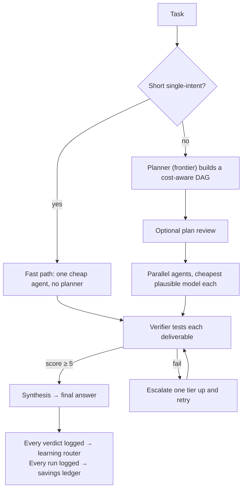

# Maestro

Maestro is a zero-dependency Node.js multi-model agent orchestrator with a
Claude-style browser UI. It plans a task, routes each step to the cheapest
plausible model, runs agents with real web and code tools, **verifies every
deliverable by actually testing it**, escalates only on proven failure, tracks
cost against a frontier-only baseline, and streams the whole run into an
interactive DAG.

**The core claim — the "no-brainer" property:** ask Maestro instead of any
single model and you can only win. The quality floor is the frontier (escalation
ends there), the average cost is the budget tier, and the output is verified
rather than hoped. Meanwhile a per-installation dataset of *which model actually
delivered on which kind of work* compounds with every run.

The project is intentionally small: one Node HTTP server, one vanilla frontend,
zero runtime dependencies, flat-file persistence with an optional cloud
database, and a single Vercel function entry for hosted deployment.

---

## Quick Start

```bash
npm start          # or: node server.js
```

Open `http://localhost:4646`, click the gear (Settings), add an OpenRouter API
key, and send a task.

Run the full UI without spending anything on models:

```bash
npm run mock       # or: MOCK=1 node server.js
```

**Requirements**

- Node.js `>=18.17` (no dependencies to install — `npm install` is optional)
- `python3` on `PATH` for Python code execution
- Optional host runtimes for more `run_code` languages: `node`, `bash`, `ruby`,
  `perl`, `java`, `swift`, `cc`, `c++`, `go`, `rustc`

**Environment variables**

| Variable | Purpose |
|---|---|
| `OPENROUTER_API_KEY` | Overrides the key stored in settings. Required for live runs unless mock mode is on. |
| `MOCK=1` | Forces simulated runs globally. |
| `PORT` | Local HTTP port, default `4646`. |
| `MAESTRO_DATA_DIR` | Overrides the runtime data directory. |
| `MAESTRO_ACCESS_CODE` | When set, every `/api/*` request must present this code (header `x-maestro-access` or cookie `maestro_access`). The UI prompts for it once. **Set this on any public deployment.** |
| `VERCEL` | Set by Vercel; switches storage and hosted-run behavior. |
| `TURSO_DATABASE_URL` | Cloud database URL (`libsql://…`). Turns on cloud persistence (chats, files, memory, settings, stats, cost ledger). Overrides the Settings value. **Prefixed names are auto-detected** — any env var whose value is a `libsql://` URL or `*.turso.io` host is picked up (e.g. `Maestro_TURSO_DATABASE_URL` from a Vercel integration with a custom prefix). `/api/settings` reports the resolved name as `cloudEnvVar`. |
| `TURSO_AUTH_TOKEN` | Cloud database auth token. Prefixed variants next to the URL var (`<PREFIX>_AUTH_TOKEN`) are detected automatically. |

---

## The Idea in One Picture

Maestro's differentiator is not "route to cheap models" — that's a commodity a
strong single model beats on hard tasks. It's the **cheap-first, escalate-on-
proof loop** plus **execution-grounded verification**:



- **Start cheap.** Every step begins on the cheapest model that can plausibly do
  it (the fast path starts on Haiku; planned nodes are routed per step).
- **Verify, don't hope.** A cheap verifier model scores each deliverable; code
  must have actually run, files must actually exist. `score >= 5` passes.
- **Escalate only on proof of failure.** A failed verdict retries **one
  capability tier up** — never re-rolling the same model, never escalating to
  something cheaper. The ladder tops out at the frontier, so the quality ceiling
  equals a frontier-only run.
- **Learn.** Every verdict (model, tools, score, pass, escalation lineage) is
  recorded. Once a model has 3+ samples on this installation, its measured pass
  rate is fed back into the planner prompt — routing gets smarter with use.
- **Prove the savings.** Each run's real cost is compared to what a
  frontier-only run of the same tokens would have cost; the delta accrues into a
  lifetime "saved vs frontier-only" badge.

---

## Runtime Modes

| Mode | Trigger | Behavior |
|---|---|---|
| **Local live** | `node server.js` | Full pipeline: fast-path check → planner → optional review → parallel agents → verification → escalation/adaptation → synthesis. Durable state. |
| **Local mock** | `MOCK=1 node server.js` | Simulated orchestration with the full streaming DAG, retries, verification, and answer output. No API key needed. |
| **Hosted live** | Deployed under Vercel | One streamed request, one focused direct agent (still verified, still escalating), sized to finish inside the 300 s function limit. With a cloud DB connected it gains full memory + persistence. |
| **Hosted mock** | Hosted Settings → Mock mode | Simulated hosted stream for checking the UI without spend. |

Hosted mode is deliberately different because Vercel functions have a hard
runtime limit and cannot share in-memory run state across requests. It avoids
the expensive planner/verifier/synthesis fan-out. **With the Turso cloud
database connected**, hosted mode stops being amnesiac: conversations and
settings persist and continue across cold starts, uploads survive (≤4 MB), the
hosted agent gets the full memory tool set plus post-run extraction (on an 8 s
leash so it never threatens the time limit), and every run lands in the cost
ledger. Without the database, hosted memory stays outline-only and nothing
persists — by design.

---

## Project Structure

```text
.
├── README.md                 This document
├── package.json              Metadata + scripts (no dependencies)
├── vercel.json               Function duration + /api rewrite (see Hosting)
├── Dockerfile / fly.toml     Full-pipeline container hosting (recommended)
├── server.js                 HTTP server, API routes, SSE, static files, access gate
├── api/
│   └── index.js              Vercel function: re-exports the server handler
├── src/
│   ├── orchestrator.js       Run lifecycle: plan, execute, verify, escalate, synthesize
│   ├── prompts.js            Planner, agent, verifier, replan, synthesis, memory prompts
│   ├── models.js             Model fleet (enable/disable per model in Settings), live pricing, routing
│   ├── tools.js              Web / code / workspace tools
│   ├── openrouter.js         Streaming OpenRouter client, retries, free-variant fallback
│   ├── store.js              Persistence facade: flat files + cloud DB, memory, stats, ledger
│   ├── db.js                 Zero-dependency Turso/libSQL HTTP client + env detection
│   ├── memory.js             Hierarchical memory register: outline, tools, search
│   ├── mock.js               Simulated run engine
│   ├── paths.js              Project/data path resolution (local vs Vercel /tmp)
│   └── util.js               IDs, truncation, JSON extraction, path normalization
├── public/
│   ├── index.html            App shell, KaTeX/Mermaid CDN links
│   ├── app.js                State, rendering, SSE, settings, memory tree, diagnostics
│   └── styles.css            Full UI styling, light/dark, responsive
├── bench/
│   ├── tasks.jsonl           27-task corpus across 5 categories
│   ├── run.js                Runner: maestro vs single-model baselines
│   └── results/              Timestamped results.jsonl + report.md (git-ignored)
├── .claude/launch.json       Local dev launch configs
└── data/                     Runtime state, git-ignored (see Persistence)
```

`data/` is never committed. On Vercel the logical data root is `/tmp/maestro-data`
— ephemeral, which is exactly why the cloud database matters for hosting.

---

## Server Architecture

`server.js` exports a single `handler(req, res)` used by both the local HTTP
server and the Vercel function.

**Startup** (`ready` promise, awaited before every request):
- `store.init()` — flat-file storage, and if a cloud DB is configured, connect,
  self-migrate the schema, and migrate existing local history up on first connect.
- `ensureLivePricing()` — background refresh of OpenRouter's model/pricing catalog.
- `initSandbox()` — detect runtimes, build the Python venv in `data/sandbox/venv`.

**Request routing:**
- `/api/*` → `handleApi()`. **Every** API route first calls `store.ensureCloud()`,
  which is a no-op when already connected and otherwise heals a flaked
  serverless cold-start connection. (This is why a chat that lives in the cloud
  no longer 404s on a warm instance that missed the first connect.)
- Everything else → `serveStatic()` from `public/`.

**Constants:** local port `4646`; JSON body limit `25 MB`; hosted graceful stop
at `270 s` (before Vercel's `300 s`); in-memory run map trimmed after 20 finished
runs.

---

## API Surface

| Method | Route | Purpose |
|---|---|---|
| `GET` | `/api/bootstrap` | Masked settings, model catalog, conversations, memory register, mock flag. Refreshes cloud state first. |
| `POST` | `/api/settings` | Save settings. Empty secret fields mean "keep existing". |
| `POST` | `/api/memories` | Add one register entry manually (path + text + type). |
| `DELETE` | `/api/memories/:id` | Forget one entry; returns the remaining register. |
| `POST` | `/api/upload` | Store an uploaded file blob + metadata. |
| `GET` | `/api/conversation/:id` | Load a saved conversation; reports an active run if present. |
| `DELETE` | `/api/conversation/:id` | Delete a conversation. |
| `POST` | `/api/run` | Start a local background run; client subscribes via EventSource. |
| `POST` | `/api/run-stream` | Start and stream a run over one response. Used by hosted mode. |
| `POST` | `/api/runs/:id/stop` | Abort an active run. |
| `POST` | `/api/runs/:id/plan` | Approve/cancel the plan-review gate, optionally with node edits. |
| `GET` | `/api/events/:runId` | SSE subscribe/replay for local runs. |
| `GET` | `/api/runs/:id/files/*` | Serve workspace artifacts under a CSP sandbox. |

**Artifact serving:** text/images/PDF/HTML render inline; SVG under a strict CSP;
HTML under `sandbox allow-scripts` (opaque origin — agent-built apps/games run
but cannot touch the Maestro origin, API, or storage); paths cannot escape the
run workspace.

---

## Orchestrator Lifecycle

Core lifecycle lives in `src/orchestrator.js`.

1. **`createRun()`** — run state, workspace path, event log, totals (including a
   frontier `baselineCost` accumulator), abort controller.
2. **Plan.** `shouldFastPath()` decides between:
   - **Fast path** — task ≤ 220 chars, single line, no attachments, no
     multi-part keywords → `createFastPlan()`: one Haiku 4.5 agent (or the
     fallback model) with the tools the task implies. No planner call, no
     15–30 s latency. Still verified, still able to escalate.
   - **Full plan** — `planPhase()` calls the orchestrator (frontier) model with
     `plannerSystemPrompt()`; `validatePlan()` normalizes nodes, caps at 12,
     drops dangling deps, rejects cycles.
3. **Review.** `approvalGate()` optionally pauses for the UI to edit/delete/approve
   nodes (local only; forced off on hosted).
4. **Execute.** `executeGraph()` runs dependency-ready nodes in parallel up to
   `maxParallel`. Each `runNode()` runs the agent loop, then:
   - **Verify** (`verifyNode()`) unless the planner waived it. `score >= 5` passes.
   - **Escalate on failure** — the retry moves one tier up via
     `escalationModel()`: `budget → Haiku 4.5 → Sonnet 4.5 → Opus 4.5`, never
     cheaper, capped at the frontier. `escalatedFrom` is tracked for the ledger.
   - **Record the verdict** (model, tools, attempt, score, pass, escalation
     lineage) into stats — the learning-router dataset.
5. **Adapt.** `maybeAdapt()` can revise pending nodes after hard failures (up to
   2 replans).
6. **Synthesize.** `synthesisPhase()` streams a single node's output directly, or
   merges all node outputs with the orchestrator model.
7. **Ledger + memory.** The run's real cost and frontier baseline are written to
   the cost ledger; `memoryPhase()` runs the post-run extractor (best-effort,
   never fails a run).

**Cost cap.** When `maxRunCost > 0` and a run's spend reaches it, the run aborts
cleanly with partial work saved and a clear message — the trust feature that
makes handing an agent an API key tolerable.

---

## The Learning Router

Every verification produces a verdict, and every verdict is routing signal:
*which model delivered on which kind of work, on this installation.* Verdicts
accumulate in `data/stats.json` (and the cloud `verdicts` table). Once a model
has **3+ samples**, its measured pass rate is injected into the planner prompt as
a "measured reliability" section — so routing is grounded in what actually
happened here, not vibes. This dataset compounds with usage and cannot be cloned
by shipping the code; it is the moat.

## The Savings Ledger

For every model call, Maestro also computes what the same tokens would have cost
on the frontier orchestrator model (`baselineCost`). The difference is what
routing saved. It accrues per-run into `data/runs.jsonl` and into a lifetime
sidebar badge ("✦ $X saved vs frontier-only"). Per-conversation savings persist
so the badge survives restarts — the retention hook and pricing anchor.

---

## Memory: the hierarchical register

Long-term, cross-conversation memory is a **register**: every durable fact lives
at a path like `preferences/format`, `privatleben/familie/kind`, or
`work/projects/maestro` (`src/memory.js`). The register differentiates as it
grows — a branch with 7+ direct entries is flagged ⚠ crowded, and the post-run
extractor migrates its entries into more specific subpaths via `move` ops.

**Token economics (the whole point):**

- **Outline in the prompt, details via tools.** Every prompt (planner, synthesis,
  each agent) gets only a compact **outline** of the register, hard-capped at
  ~1600 chars. While the register is small the outline *is* the full content (so
  no tool round is ever wasted); past the budget it compresses to truncated
  facts and branch summaries, prioritizing recently used branches.
- **Every agent carries four tools** (granted automatically, never planned):
  `memory_search` / `memory_read` pull details on demand (reads bump `usedAt`,
  which drives outline priority), `memory_write` stores a durable fact the moment
  it appears mid-run, `memory_forget` deletes by id. Search is scored substring
  matching over path + text — no embeddings, which at register scale is both
  sufficient and debuggable.
- **Post-run extractor.** A cheap model reviews the exchange against the register
  (with ids), files what agents missed, prunes contradicted entries, and splits
  crowded branches. "No changes" is the expected outcome for most tasks; secrets
  are banned from storage by prompt.

**Consistency across serverless instances.** Because the outline is read
synchronously from an in-memory cache, `refreshMemories()` re-reads the register
from the cloud on `/api/bootstrap` and at run start, so an agent (or the Settings
tree) sees facts written by other instances — with a guard that keeps the
existing cache if a cloud read transiently fails.

Every entry is visible and one-click-deletable in Settings, rendered as a
collapsible path tree with per-branch counts and crowded flags. A global toggle
turns the whole system off.

---

## Persistence

`src/store.js` is a facade over two backends:

- **Local flat files** under the data root — always on, zero-config.
- **Cloud libSQL/Turso database** (`src/db.js`, plain-`fetch` HTTP client, no
  dependencies) — optional. Configure via Settings → Cloud database or the
  `TURSO_*` env vars (prefixed names auto-detected). When connected,
  conversations, files (≤4 MB), settings, memory, verdicts, and the run cost
  ledger are written through and read back — chats continue across restarts,
  machines, and hosted deployments. The schema self-migrates
  (`CREATE TABLE IF NOT EXISTS`) on every connect; existing local history is
  migrated up on first connect; an unreachable cloud degrades to local files
  instead of breaking.

| Path / table | Contents |
|---|---|
| `data/settings.json` | Keys, model choices, preferences, cloud DB credentials (kept local to bootstrap the connection). |
| `data/conversations/*.json` · `conversations` | Chat messages, run snapshots, cost, savings. |
| `data/files/*` · `files` | Uploaded bytes + metadata/previews. |
| `data/memory.json` · `memory` | The hierarchical register (path, text, type, timestamps). |
| `data/stats.json` · `verdicts` | Verifier verdicts per model — the learning-router dataset. |
| `data/runs.jsonl` · `runs` | Append-only cost ledger: cost, frontier baseline, savings, tokens per run. |
| `data/workspaces/<runId>/` | Per-run staged inputs and generated artifacts. |
| `data/sandbox/venv/` | Python virtualenv for code execution. |
| — · `kv` | Cloud key/value for settings on hosted (tmpfs) deployments. |

---

## Agent Tools

Tools live in `src/tools.js`, exposed by group in a node plan:

| Group | Tools |
|---|---|
| `web` | `web_search`, `fetch_url` |
| `code` | `run_code`, `pip_install`, `write_file`, `read_file`, `list_files` |
| `memory` | `memory_search`, `memory_read`, `memory_write`, `memory_forget` (auto-granted, not planned) |

- **Web:** Brave Search when `braveApiKey` is set, DuckDuckGo fallback; `fetch_url`
  allows only public `http(s)` and blocks local/private addresses; fetched text
  is stripped and capped.
- **Code:** isolated workspace per run under `data/workspaces/<runId>`; Python
  uses a venv with numpy/pandas/matplotlib/sympy/openpyxl available; the child
  env strips key/token/secret/password-looking variables; `MPLBACKEND=Agg` for
  headless charts; `run_code` capped at 120 s, `pip_install` at 240 s with name
  validation; `write_file` refuses >2 MB and cannot escape the workspace.

---

## Model Fleet

Defined in `src/models.js` — 17 models across **frontier / mid / budget** tiers
(Claude, OpenAI, Gemini, GLM, Nemotron, DeepSeek, Qwen, Kimi, Grok, Mistral),
each annotated with price, context, vision, reasoning, and honest
strengths/weaknesses the planner reads.

At startup `ensureLivePricing()` fetches OpenRouter's catalog and updates prices,
context lengths, availability, and `:free` variant support. `routeModel()` uses a
`:free` variant first when `preferFree` is on and it can satisfy tool
requirements; `openrouter.js` retries the paid slug if the free route fails or
rate-limits. `escalationModel()` implements the tier ladder used on verifier
failure.

---

## Frontend

Vanilla HTML/CSS/JS in `public/`, no build step.

- **`index.html`** — sidebar, chat, composer, modal root, upload input; KaTeX +
  Mermaid from CDN (fail gracefully offline).
- **`app.js`** — global UI state; markdown/code/table/math/Mermaid/artifact
  rendering; DAG, node cards, plan editor, activity logs, verifier results,
  artifacts, final answer; settings, theme, uploads, chat list, conversation
  restore, send/stop, stream recovery. Uses `/api/run` + `/api/events/:id`
  locally and `/api/run-stream` hosted. The Settings memory tree renders the
  register as collapsible branches with hover-to-forget.
- **`styles.css`** — light/dark via CSS variables; responsive mobile layout.

**Client diagnostics.** The `api()` helper logs every call (method, path, status,
duration, and whether a 404 came from the Maestro handler or the platform) into a
rolling buffer. Run **`maestroDebug()`** in the browser console for a
copy-pasteable report — client state, live cloud status, recent API calls, and a
last-conversation fetch check — for fast bug reports.

---

## Prompts

All prompt builders live in `src/prompts.js`. Editing them is the main way to
change Maestro's behavior.

| Function | Role |
|---|---|
| `plannerSystemPrompt()` / `plannerUserPrompt()` | Cost-aware DAG planning; injects date, memory outline, conversation, attachments, and measured model reliability. |
| `agentSystemPrompt()` | Each node's standalone brief, deliverables, tool rules, memory outline + rules, exact-format rule. |
| `verifierSystemPrompt()` / `verifierUserPrompt()` | Verification standards and the `score >= 5` pass rule. |
| `replanSystemPrompt()` / `replanUserPrompt()` | Recovery after failed nodes. |
| `synthesisSystemPrompt()` / `synthesisUserPrompt()` | The final user-facing answer. |
| `memorySystemPrompt()` / `memoryUserPrompt()` | The post-run register extractor (add/move/remove ops). |

---

## Settings

Defaults in `src/store.js`.

| Setting | Default | Notes |
|---|---|---|
| `apiKey` | empty | Local unless `OPENROUTER_API_KEY` overrides. |
| `braveApiKey` | empty | Optional; sharper web search. |
| `userName` | `Mateo` | Greeting/avatar. |
| `orchestratorModel` | `anthropic/claude-opus-4.5` | Planner, replanner, synthesis, hosted agent — **and the frontier baseline** for savings. |
| `verifierModel` | `openai/gpt-5-mini` | Verifier and post-run memory extractor. |
| `fallbackModel` | `openai/gpt-5-mini` | Used when a planned/fast-path model is unavailable. |
| `maxParallel` | `4` | Graph concurrency, clamped `1..8`. |
| `maxRetries` | `1` | Retries after verifier failure (each escalates a tier), clamped `0..3`. |
| `maxRunCost` | `0` | Hard per-run USD ceiling; run aborts cleanly when reached. `0` disables. |
| `approvePlans` | `true` | Local plan-review gate. Forced off on hosted. |
| `preferFree` | `true` | Try OpenRouter `:free` variants first. |
| `memoryEnabled` | `true` | The hierarchical register (outline + tools + extractor). |
| `mock` | `false` | Simulate runs without model calls. |
| `tursoUrl` / `tursoToken` | empty | Cloud DB credentials; `TURSO_*` env vars override both. |

Hosted UI settings persist in browser `localStorage` (`maestro-hosted-settings`)
and are sent with each `/api/run-stream` call, since Vercel's filesystem is
ephemeral.

---

## Hosting

### Docker / Fly.io / Railway — recommended (full pipeline)

A long-running container runs the exact same pipeline as local mode: fast path,
planner, parallel agents, verification, escalation, replanning, synthesis,
durable state. **This is the deployment to show people.**

```bash
docker build -t maestro .
docker run -p 4646:4646 -v maestro_data:/data \
  -e OPENROUTER_API_KEY=sk-or-... \
  -e MAESTRO_ACCESS_CODE=choose-a-code \
  maestro
```

Fly.io (`fly.toml` included): `fly launch --no-deploy`, create a `maestro_data`
volume, `fly secrets set OPENROUTER_API_KEY=… MAESTRO_ACCESS_CODE=…`, `fly deploy`.
Railway picks up the `Dockerfile` automatically — attach a volume at `/data` and
set the same two variables.

**Always set `MAESTRO_ACCESS_CODE` on a public deployment** — the server spends
your key and executes model-written code. The deployment is single-tenant (all
visitors share one settings file and conversation list).

### Vercel — hosted single-agent mode

`vercel.json` maps **all** `/api/*` requests to one function via a rewrite:

```json
{
  "functions": { "api/index.js": { "maxDuration": 300 } },
  "rewrites": [{ "source": "/api/(.*)", "destination": "/api" }]
}
```

The rewrite is required: Vercel's file-based catch-all only reliably matched a
single path segment, so nested routes (`/api/conversation/:id`,
`/api/runs/:id/*`, `/api/events/:id`) fell through to the platform's own 404 and
never reached the handler. Routing everything to `api/index.js` — which receives
the original `req.url` — fixes every depth; static assets stay on the CDN.

To enable persistence, connect a Turso database (the Vercel integration injects
`TURSO_*` env vars, prefixed names included) and **redeploy**. The Settings panel
reports `cloudConnected` and the resolved `cloudEnvVar`. Constraints of hosted
mode: no plan review, one direct (still-verified) agent, smaller tool/output
budgets, and a 270 s graceful stop before the 300 s hard limit. Use the container
or local mode for real multi-agent jobs.

---

## Benchmarks

`bench/tasks.jsonl` is a 27-task corpus across `code`, `math`, `research`,
`realworld`, `agentic`; `bench/run.js` turns the core claim — frontier-quality at
a fraction of frontier cost — into a measured number.

```bash
npm run bench                       # maestro vs opus-only, all tasks
node bench/run.js --only c1,m1      # subset by id
node bench/run.js --category code   # subset by category/tier
node bench/run.js --modes maestro,single:openai/gpt-5.1
node bench/run.js --mock            # pipeline smoke test, zero spend
node bench/run.js --list            # show the corpus
```

Each task runs through `maestro` (full pipeline) and `single:<model>` baselines
(one agent node, same tools, no verifier/retries) and is scored by its `scoring`
field:

| Scoring | How it's graded |
|---|---|
| `tests` | The task's Python asserts run against the workspace. |
| `exact` | The expected string must appear in the answer. |
| `judge` | A judge model (default `gpt-5.1`) scores 0–10. |
| `judge+checks` | Judge score gated by programmatic checks (artifacts exist, tests pass, citations present); failed checks cap the score at 4. |
| `exact-runtime` | Live-web tasks — judged, since there is no offline ground truth. |

Results land in `bench/results/<timestamp>/` as `results.jsonl` + `report.md`
(mode comparison: "Maestro X% pass at $A vs opus-only Y% at $B"). `preferFree` is
off during benchmarks so costs reflect real paid prices; runs bill your key.

> The most decisive experiment is the agentic/realworld tier against Sonnet and
> Opus — that measures the actual product (real DAG fan-out, escalation, the
> savings delta), not just routing on easy tasks where any model passes.

---

## Security and Cost Notes

- `data/` is git-ignored (it may hold API keys, uploads, conversations, artifacts).
- Task content is routed to model providers through OpenRouter.
- `run_code` executes model-written code on the host, scoped to the workspace
  with secrets stripped from the child env — but it is **not** a container or VM.
- `fetch_url` blocks localhost and private-network addresses.
- API keys are masked when sent to the browser; secrets are banned from memory.
- Costs are accumulated per call, node, run, and conversation, and compared to
  the frontier baseline for the savings ledger.
- The Stop button aborts the run's `AbortController`; `maxRunCost` is a hard
  ceiling.

---

## Development Notes

- No build step, no runtime dependencies.
- Change behavior in `src/prompts.js`, routing/escalation in `src/models.js`, and
  the run lifecycle in `src/orchestrator.js`.
- Syntax-check the tree:

  ```bash
  for f in server.js api/index.js src/*.js public/app.js; do node --check "$f"; done
  ```

- No-spend UI smoke test: `MOCK=1 node server.js`.
- Vercel smoke tests should use hosted mock mode or a request body with
  `settings: { "mock": true }` to avoid spending tokens.
- In the browser console, `maestroDebug()` prints a diagnostics report for bug
  reports.
```
